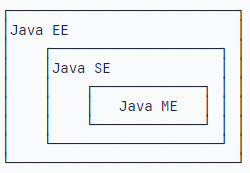

# 起源
Java最早是由SUN公司（oracle收购）的詹姆斯.高斯林，在上世纪90年代初开发的一种高级的面向对象编程语言。

# 版本
* 正式版发布：1995年5月23日
* 标准版发布：1996年12月
* JDK1.0发布：1996年5月
* JDK1.1发布：1997年2月
* JDK1.2发布：1998年2月
* JDK1.3发布：2000年5月
* JDK1.4发布：2002年2月
* JDK1.5发布：2004年9月
* JDK1.6发布：2006年12月
* JDK1.7发布：2011年7月
* JDK1.8发布：2014年3月
* JDK1.9发布：2017年3月
* JDK10发布：2018年3月
* JDK11发布：2018年9月
* JDK12发布：2019年3月
* JDK13发布：2019年9月
* JDK14发布：2020年3月
* JDK15发布：2020年9月
* JDK16发布：2021年3月
* JDK17发布：2021年9月
* JDK18发布：2022年3月
* JDK19发布：2022年9月
* JDK20发布：2023年3月
* JDK21发布：2023年9月
* JDK22发布：2024年3月
* JDK23发布：2024年9月

Java分出三个不同版本：
+ JavaSE（Java Platform Standard Edition）标准版
+ JavaEE（Java Platform Enterprise Edition）企业版
+ JavaME（Java Platform Micro Edition）微型版

# 名词
* JVM（Java Virtual Machine）：Java虚拟机
* JRE（Java Runtime Environment）：Java运行环境
* JDK（Java Development Kit）：Java开发工具包
* JIT（Just In Time）：即时编译器
* JAR（Java Archive）：Java归档文件
* JSP（Java Server Pages）：Java服务器页面
* JDBC（Java Database Connectivity）：Java数据库连接
* JNDI（Java Naming and Directory Interface）：Java命名和目录接口
* JAXP（Java API for XML Processing）：Java API for XML处理
* JAX（Java API for XML）：Java API for XML
* JAF（JavaBeans Activation Framework）：JavaBeans激活框架
* JWS（Java Web Start）：Java Web启动
* JSA（Java Security Architecture）：Java安全架构
* JAXM（Java API for XML Messaging）：Java API for XML消息
* JAXR（Java API for XML Registry）：Java API for XML注册
* JAXB（Java API for XML Binding）：Java API for XML绑定
* JDO（Java Data Object）：Java数据对象
* JSR（Java Specification Request）：Java规范请求
* JCP（Java Community Process）：Java社区进程

