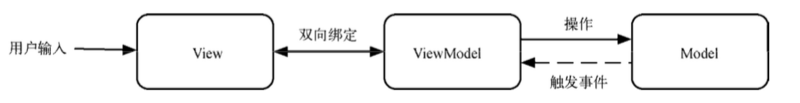
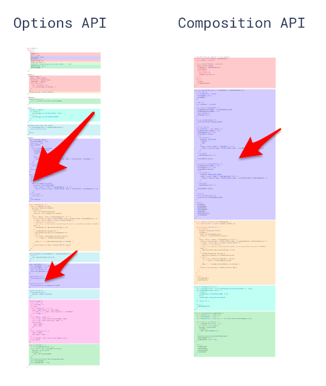

# 1. 前言
Vue是一个js框架，基于HTML，CSS和JavaScript构建的，提供了一套声明式、组件化的编程模型，可以用于构建用户界面、高效开发。

> 渐进式框架
>> Vue设计很灵活，可以“被逐步集成”，根据不同的场景，可以选择不同的使用方式

# 1.1. vue框架优势
1. 轻量级
2. 高性能：虚拟DOM和响应式避免了全局重新渲染，提升性能和用户体验。
3. 易上手

# 1.2. vue框架核心
核心：**组件化、MVVM、响应式、生命周期**。
   
组件化：vue可以将一个页面的html、css、js组合到一个文件里形成组件，便于复用

MVVM双向数据绑定：避免操作dom。在vue之前，要完成html和js之间的交互，需要通过操作dom实现动态加载


响应式（虚拟DOM）: vue会自动跟踪js状态并在其发生变化时响应式的更新DOM

生命周期：开发者可以通过钩子函数在组件的生命周期的不同时刻进行相应的操作。

# 2. vue3 vs vue2
2023年12月31号，vue2 停止维护。
2020年9月18号，发布3.0版本。截止2024年8月，最新版本是V3.5.0-beta.2。[官方发布链接](https://github.com/vuejs/core/releases)

## 2.1. 明显的性能提升
1. 打包大小减少41%（tree traking）
2. 初次渲染快55%，更新快133%
3. 内存使用减少54%

## 2.2. 源码升级
1. 使用Proxy代替defineProperty实现响应式数据 
2. 重写虚拟DOM的实现和Tree-Shaking

   | -    | 核心|问题| 
   |------|---------------------------|--|
   | vue2 | Object.defineProperty 来劫持各个属性的setter、getter，在数据变动时发布消息给订阅者，触发相应的监听回调.对象：递归调用defineProperty对对象已有属性值的读取和修改进行拦截; 数组：重写数组更新数组一系列更新元素的方法来实现元素修改的劫持| 1. 不能监听到对象属性的添加和删除，需要Vue.set()来添加和删除。2. 不能通过下标替换元素或更新length|
   |vue3|	通过Proxy(代理): 拦截对data任意属性的任意(13种)操作, 包括属性值的读写, 属性的添加, 属性的删除等通过 Reflect(反射): 动态对被代理对象的相应属性进行特定的操作|-|

## 2.3. 拥抱TypeScript
vue3可以更好的支持ts。

## 2.4. 新的特性
### 2.4.1. 组合API
Composition API是一系列api的组合，是V3和V2.7的内置功能。可以使用函数的方式书写vue组件（vue2是声明选项式），它包括如下api：
* 响应式API（ref、reactive）
* 生命周期钩子（onMounted、onUnmounted）
* 依赖注入（provide、inject）

V2选项式，V3支持选项式和组合式，官方推荐组合式api。在V3中组合式api需要配合`<script setup>`语法使用。

优势
1. 更好的逻辑复用——使我们可以使用组合函数来实现更加简洁高效的逻辑复用，避免了mixin的缺陷。
2. 更灵活的组织代码——选项式api使得逻辑分散在各个选项里，组合式api逻辑关注点更加集中，抽取更加简单，可以像写普通js函数一样书写代码
3. 更好的类型判断——主要针对TS
4. 更小的生产包体积——选项式api中的变量需要通过this代理，对于代码压缩来说需要处理，组合式api没有
5. 更好的IDE支持——选项式api中变量需要通过this代理，对于代码提示来说需要处理，组合式api没有



```vue
<template>
  <!-- 使此按钮生效 -->
<button @click="add">count is: {{ count }}</button>
</template>

<script setup lang="ts">
import { ref } from 'vue'
const count = ref(0);
const add = () => {
    count.value++
}
</script>
```


### 2.4.2. 新的内置组件
* `<Transition>`  制作基于状态变化的过渡和动画
* `<TransitionGroup>`
* `<KeepAlive>`  在多个组件间动态切换时缓存被移除的组件实例
* `<Teleport>`
* `<Suspense>`

### [2.4.3. 新的生命周期钩子](https://cn.vuejs.org/api/composition-api-lifecycle)
* onMounted()  用来在组件完成初始渲染并创建 DOM 节点后运行代码
* onUpdated()
* onUnmounted()  在组件实例被卸载之后调用
* onBeforeMount()
* onBeforeUpdate()
* onBeforeUnmount()
* onErrorCaptured()
* onRenderTracked()
* onRenderTriggered()
* onActivated()
* onDeactivated()
* onServerPrefetch()

### 2.4.4. 全局API挂载调整
在v2中的main.js中有以下代码。如果使用全局api则是 Vue.directive、Vue.component、Vue.config、Vue.mixin、Vue.prototype等，都是挂载在Vue原型上
V3绑定在vue实例上，vue实例通过createApp创建

## 2.5. V3移除的API
1. $children ：在v2中，可以使用this.$children访问当前实例的子组件。vue3中已移除，推荐使用$refs
2. filter过滤器：在v2中，可以使用过滤器来处理数据格式。v3中已移除，推荐使用方法调用或计算属性
3. $listeners：在v3中移除这一方法，由$attrs负责传递方法

# 3.vue3最佳实践

* [单文件组件（即 *.vue 文件）](https://cn.vuejs.org/guide/scaling-up/sfc)
* 组合式API+TypeScript

注：组合式API一般都会配合`<script setup>`语法在单文件中使用

[演练场](https://play.vuejs.org/#eNp9kt9qE0EYxV9lXISmNNmIelU2QS0VFPyDzeVcdN2dpNNuZpad2RhZFlJQC1VpU9NeqBhEqlEorVQEq30and34Fn6zm6QtSC8C4TvnO/ObsxMZ133fbIXEmDUsSZq+Z0tSxQwh60KphNTmftob/Dl6ln79qd49Tz50kv6u2noxXPui1gfD97vq6QCVStlCFCGHh0yakt+kbeIWLk+jOAbFehhKyRm65njUWalgw3ZdbFTntBlRMTvZBLtVzs2QaJXP8MBAOAH1JRJEhj7ybNaALCkgqlw+Ic3U4f5ecridHu4Aa+2xTxayTR1Dmz4PJIpQQOpFxNkdfTBxUYzqAW+iKahiCjPMdOSrl+qop35tpOvfk84qZg5nQo5QKzqgcGl65E3efEt6P3Lj787q8NNHtdHVw52D9PUTtXacbB+MA+D6sF6YRpUqijRTXlvL9kIyM4MZdJZlpr2+6h6r7iB52/+79VntbWI2AS6c2WeCe8T0eKOwWFsiiDIqqe2NUKlAF6NTZ8TmImDH8LPKeaVQsFGEKiGoThvmsuAM3kOWjQ2HN33qkeCeLykchA34YFrRmu15/NHtbCaDkBTHc2eJOCv/mS+Ltp5h435ABAlaBBsTTdpBg8hcnl+4S9rwfyI2uRt64D5HfECghFAz5rYbIXMB+5Qvo72VPQDKGjUx35aEifGlNKh2xpkfG/AS5s65+gnuFfNqtgedGvE/zfVJWw==)

```vue
<template>
  <!-- 启用了类型检查和自动补全 -->
{{ count.toFixed(2) }}
<button @click="add">Count is: {{ count }}</button>
</template>

<script setup lang="ts">
   // 启用了setup语法糖和TypeScript
  import { ref, onMounted } from 'vue'

// 响应式状态
const count = ref(0)

// 更改状态、触发更新的函数
const add = () => {
  count.value++
}

// 生命周期钩子
onMounted(() => {
  console.log(`The initial count is ${count.value}.`)
})
</script>


<style scoped lang="scss">
/* CSS 代码 */
</style>
```

