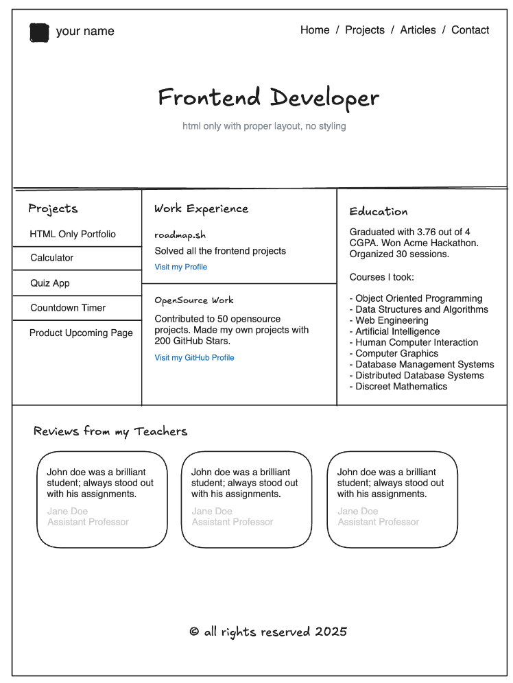

# HTML基础
## 什么是HTML
HTML 是用于创建网页的标记语言。
HTML 指的是超文本标记语言：
* HTML 指的是超文本
* HTML 是标记语言（markup language）
* HTML 由标签组成，例如 `<html>`
* HTML 由浏览器解释，浏览器会显示 HTML 标记的网页

## 什么是HTML5
HTML5 是 HTML 的最新版本。
HTML5 提供了新的元素和属性，是 HTML 的下一个主要版本。

## HTML文件结构
HTML 文件通常包含 HTML 标签和网页内容。
HTML 文件可以包含图像、视频、音频、PDF 等任何其他媒体。
HTML 文件也可以包含 JavaScript 和 CSS。

### HTML 页面组成
#### 头部
HTML 头部是通过 `<head>` 标签进行定义的。
* 元数据：使用 `<meta>` 标签定义文档的元数据。
* 标题：使用 `<title>` 标签定义文档的标题。
* 样式：使用 `<link>` 标签定义文档的外部样式表。
* 脚本：使用 `<script>` 标签定义文档的外部脚本。
* 字符集：使用 `<meta charset="utf-8">` 标签定义文档的字符编码。

#### 主体
HTML 主体是通过 `<body>` 标签进行定义的。

#### 样式
HTML 内嵌样式是通过 `<style>` 标签进行定义的。

## 常用标签
### 标题
HTML 标题是通过 `<h1>` 到 `<h6>` 标签进行定义的。
`<h1>` 定义最大的标题。
`<h2>` 定义第二大的标题。
`<h3>` 定义第三大的标题。
`<h4>` 定义第四大的标题。
`<h5>` 定义第五大的标题。
`<h6>` 定义第六大的标题。

### 段落
HTML 段落是通过 `
` 标签进行定义的。
`
` 标签定义一个段落。

### 换行
HTML 换行是通过 ` ` 标签进行定义的。

### 水平线
HTML 水平线是通过 `
` 标签进行定义的。

### 图像
HTML 图像是通过 `` 标签进行定义的。

### 超链接
HTML 超链接是通过 `<a>` 标签进行定义的。

### 列表
HTML 列表是通过 `<ul>`、`<ol>` 和 `<dl>` 标签进行定义的。
* 无序列表：使用 `<ul>` 标签定义无序列表。
* 有序列表：使用 `<ol>` 标签定义有序列表。
* 定义列表：使用 `<dl>` 标签定义定义列表。
* 列表项：使用 `<li>` 标签定义列表项。
* 定义列表项：使用 `<dt>` 标签定义定义列表项。
* 定义列表项：使用 `<dd>` 标签定义定义列表项。

### 表格
HTML 表格是通过 `<table>` 标签进行定义的。
* 表格行：使用 `<tr>` 标签定义表格行。
* 表格头：使用 `<th>` 标签定义表格头。
* 表格数据：使用 `<td>` 标签定义表格数据。
### 表单
HTML 表单是通过 `<form>` 标签进行定义的。
* 输入元素：使用 `<input>` 标签定义输入字段。
* 按钮元素：使用 `<button>` 标签定义按钮。
* 选择元素：使用 `<select>` 标签定义下拉列表。
* 文本区域元素：使用 `<textarea>` 标签定义多行输入字段。
* 输入类型：使用 `<input>` 标签的 type 属性定义不同类型的输入字段。

## 注释
HTML 注释是通过 `<!-- -->` 进行定义的。

## 练习题
使用 HTML 构建网站页面，即网站的不同部分，如页眉、页脚、导航、主要内容、侧边栏等。不要设计网站样式，只关注结构。样式将在其他单独的项目中完成。
在此项目中，您需要创建一个包含多个页面的简单 HTML 网站。该网站应具有以下页面：
* 主页
* 项目
* 文章
* 联系

网站应该有一个导航栏，该导航栏应该出现在所有页面上并链接到所有页面。 不需要设计网站的样式，只需使用 HTML 创建网站的结构。该项目的目标是：
* 了解如何在网站中创建多个页面。
* 使用 HTML 以语义方式构建网站。
* 向网站添加 SEO 元标记。

* [练习题 参考社区解决方案](https://roadmap.sh/projects/basic-html-website/solutions)
* [MDN 文档](https://developer.mozilla.org/zh-CN/docs/Web/HTML)
