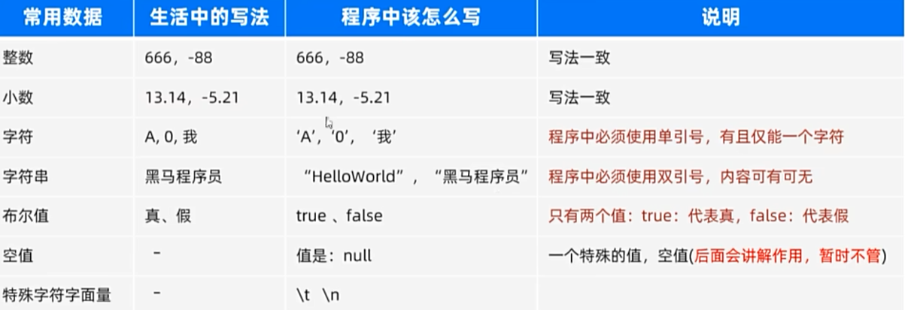

#  注释
## Java 注释
 1. 单行注释：//
2. 块注释 /* */
3. 文档注解 /** */


# 字面量




# 变量
 就是内存中的一块区域，用来存储数据。


## 变量命名规则
1. 变量名必须由字母、数字、下划线、$组成，且不能以数字开头。
2. 变量名区分大小写，例如：name 和 Name 是两个不同的变量名。
3. 变量名不能使用关键字和保留字，如 public、class 等。
4. 变量名应该简洁明了，尽量做到见名知意。
5. 驼峰式命名法：第一个单词小写，后面的每个单词首字母大写。例如：userName、userAge

## 变量定义格式
 数据类型 变量名 = 值;
```java
int a = 10;
String name = "hello";
boolean flag = true;
double d = 3.14;
```

## 变量里数据的存储原理

二进制：0、1，计算机底层都是二进制，逢2加1。 
10进制转2进制：除2取余数，再倒序输出。

计算机找那个表述数据的最小单位
1字节(byte)：8bit(8个二进制位)   1B = 8b

* 1KB = 1024B
* 1MB = 1024KB
* 1GB = 1024MB
* 1TB = 1024GB


存储
* 文本，字符串-》二进制
* 图片-》二进制
* 音、视频-》二进制


## 数据类型
1. 基本数据类型：byte、short、int、long、float、double、char、boolean
2. 引用数据类型：类、接口、数组


## 关键字、标识符


