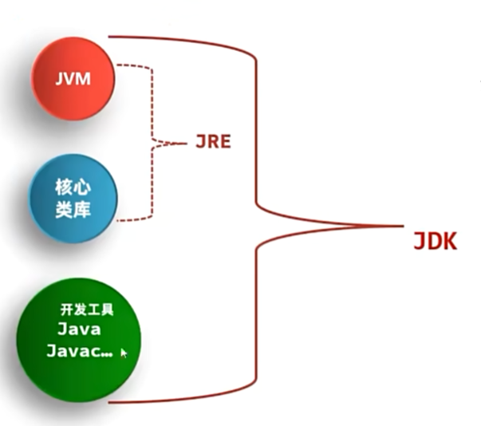

# JDK
JDK是Java开发工具包，包含了Java的开发工具。
[JDK下载](https://www.oracle.com/java/technologies/downloads/)

## 查看安装版本
```
java -version
javac -version
```
## JDK组成
```js
JDK
  |-JRE
  |  |-JVM // Java虚拟机
  |  |-核心类库
  |  
  |-开发工具
    |-Javac(编译工具)
    |-Java(运行工具) 
    
 ``` 
    
      
JVM（Java Virtual Machine）是Java虚拟机，真正运行java程序的地方。

核心类库是Java的核心，包含Java的基本类。

JVM和核心类库合称为JRE(Java Runtime Environment)是Java运行环境。




# 开发工具
  IDEA(IntelliJ IDEA) 