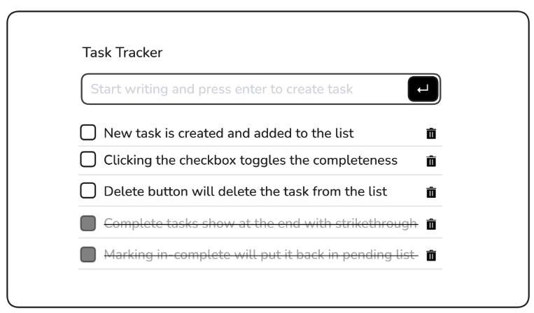

# js基础知识
## 什么是js?
> js是一门编程语言，浏览器内置了js的解释器，我们只需要写js代码，就可以让浏览器执行。
> js是一门解释性语言，不需要编译，一行一行的执行。
> js是弱类型语言，不需要声明变量类型。
> js是面向对象语言，一切皆对象。
> js是事件驱动语言，通过事件触发相应的代码执行。
> js是单线程语言，同一时间只能做一件事。
> js是解释型语言，运行在浏览器中。
> js是脚本语言，没有编译环节。

初级学习目录：
* 语法和数据类型
* 流程控制和错误处理
* 迭代和循环
* 表达式和运算符
* 数字和日期
* 使用对象
* 使用类
* promise
* [ES6](https://wangdoc.com/es6/)

按照[MDN文档的顺序，进行学习即可](https://developer.mozilla.org/zh-CN/docs/Web/JavaScript/Guide/Introduction)

# 练习题
你需要创建一个任务跟踪器,允许用户添加新任务,标记它们为完整任务,或者删除它们。已完成的任务将移到列表的末尾,并将进行删除,用户可以取消标记任务,将其返回到挂起的列表中。
效果如下图：

提示：
将你的任务存储在一个对象数组中,其中每个对象代表一个具有描述和状态(已完成或未完成)等属性的任务。每当添加、更新、删除或标记为完整/不完整的新任务时,都要更新任务数组。写一个函数renderTasks 它将删除所有的任务,并根据更新的任务数组重新提交它们。
这个项目将帮助您使用JavaSoript来练习数组操作、事件处理和动态DOM更新

* [练习题 参考社区解决方案](https://roadmap.sh/projects/task-tracker-js/solutions)

