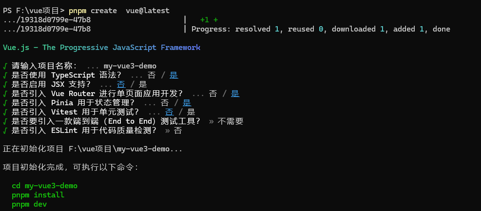

# 环境准备
* 安装开发工具webstorm
* 安装node.JS V22以上
* 安装pnpm

[参考文档](https://alidocs.dingtalk.com/i/nodes/mExel2BLV542BPQ7TYzKdME3Wgk9rpMq?doc_type=wiki_doc&iframeQuery=utm_source%3Dportal&rnd=0.8096921321985786&utm_medium=dingdoc_doc_plugin_url&utm_source=dingdoc_doc)

# 技术栈组成

 | 名称                        | 描述                       | 官网                                                                                                                                                                             |
 |---------------------------|--------------------------|--------------------------------------------------------------------------------------------------------------------------------------------------------------------------------|
 | npm                       | 包管理工具                    | https://www.npmjs.com/                                                                                                                                                         |
 | pnpm                      | 包管理工具                    | https://pnpm.io/zh                                                                                                                                                             |
 | vite                      | 开发服务器                    | https://vitejs.dev/                                                                                                                                                            |
 | vue3                      | 渐进式 JavaScript 框架        | https://cn.vuejs.org/                                                                                                                                                         |
 | TypeScript                | JavaScript 的超集               | https://www.typescriptlang.org/                                                                                                                                                  |
| vue-router                | 路由管理器                    | https://next.router.vuejs.org/zh                                                                                                                                               |
 | pinia                     | 全局状态管理工具                 | https://pinia.vuejs.org/zh                                                                                                                                                     |
 | antd design vue           | 基于 Vue 3 的桌面端组件库         | https://antdv.com/                                                                                                                                                             |
| **zk-component-ts-vue3**  | 自定义组件库                   | [链接](https://ci.zoomkey.com.cn/view/%E5%89%8D%E7%AB%AF%E7%BB%84%E4%BB%B6%EF%BC%88%E5%AD%B5%E5%8C%96%E5%99%A8%EF%BC%89/job/component-ts-vue3v3/ws/build/dist/index.html#/guide) |
 | axios                     | 基于 XMLHttpRequest 的异步通信库 | https://github.com/axios/axios                                                                                                                                                 |
 | pinia                     | 状态管理工具                   | https://pinia.vuejs.org/zh                                                                                                                                                     |
 | sass                      | 样式预处理器                   | https://sass.bootcss.com/                                                                                                                                                      |
 | eslint                    | 代码风格检查工具                 | https://eslint.org/                                                                                                                                                            |
 | prettier                  | 代码格式化工具                  | https://prettier.io/                                                                                                                                                           |


# 熟悉常用命令
```js
pnpm install // 安装依赖
pnpm run dev // 运行项目
pnpm run build // 打包项目
pnpm run preview // 预览打包
pnpm run help // 查看帮助
```

# 创建一个Vue项目
```js
// 创建vue3项目
pnpm create  vue@latest 

// 安装依赖
pnpm install
```



# 了解项目目录结构树形图 (仅供参考)
```js
.
├── node_modules // 依赖包
├── public // 静态资源
│   └── favicon.ico // 图标
├── src // 源码
│   ├── assets // 静态资源
│   │   └── logo.png
│   ├── components // 组件
│   ├── router // 路由配置文件
│   ├── store // 状态管理文件
│   ├── views // 页面
│   ├── App.vue // 页面入口文件
│   ├── main.ts // 实例入口文件
├── package.json  // 配置文件
├── pnpm-lock.yaml // 依赖包版本
├── tsconfig.json // ts配置文件
├── vite.config.ts // vite配置文件
├── .gitignore // git忽略文件
├── .eslintrc.js // eslint配置文件
├── .prettierrc // 格式化配置文件
├── .editorconfig // 编辑器配置文件
└── README.md // 项目说明

```
