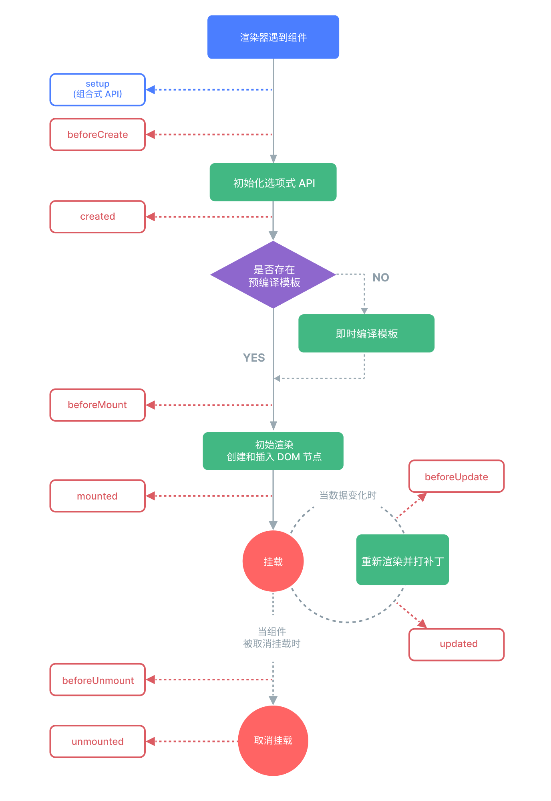

时长：10min

本节重点
1. 插值语法、指令和修饰符
2. 生命周期
3. 响应式基础


# Vue 基础
## [模板语法](https://cn.vuejs.org/guide/essentials/template-syntax.html)
### 文本插值
- 文本数据：`{{}}`
```vue
  <div id="app">{{ message }}</div>
 ```

* 表达式：`{{}}`
支持单一表达式或者方法
```vue
<div >{{ message + '!' }}</div>
<div >{{ buildData() }}</div>
  ```
### 属性绑定
- 属性绑定：`v-bind:属性名="变量"`
- 简写：`:属性名="变量"`
```vue
<div :id="myId" ></div>
```
### 动态绑定多个值
```vue
const myObj= {
  id: '123',
  class: 'red'
};
<div v-bind="myObj"></div>
```
## 内置指令
指令是带有 v- 前缀的特殊 attribute。Vue 提供了许多[内置指令](https://cn.vuejs.org/api/built-in-directives)。
### 属性绑定
- v-bind:属性名="变量"
- :属性名="变量"

### 事件绑定
- v-on:事件名="方法"
- @事件名="方法"

### 双向绑定
- v-model="变量"

### 条件渲染
- v-if
- v-else-if
- v-else
- v-show
### 列表渲染
- v-for="item in items"
- v-for="(item, index) in items"


### 修饰符
以点开头的特殊后缀，表明指令需要以一些特殊的方式被绑定
- .stop
- .prevent 
```vue
<button @click.stop="doThis"></button> // 阻止事件冒泡
<button @click.prevent="doThis"></button>// 阻止默认行为,调用 event.preventDefault()
```

## [生命周期](https://cn.vuejs.org/api/composition-api-lifecycle)
Vue 实例从创建到销毁的过程，就是生命周期。

最常用的是 onMounted 和 onUnmounted。

* onMounted() 在组件挂载完成后执行。</br>
  通常在 onMounted 钩子中完成初始化操作，例如获取数据等。

* onUpdated() 在组件因为响应式状态变更而更新其 DOM 树之后调用。</br>
  需要在某个特定的状态更改后访问更新后的 DOM，使用 **nextTick()**。

* onUnmounted() 在组件实例被卸载之后调用。</br>
  可以在这个钩子中手动清理一些副作用，例如计时器、DOM 事件监听器或者与服务器的连接

* onActivated()</br>
  若组件实例是` <KeepAlive> `缓存树的一部分，当组件被插入到 DOM 中时调用。

* onDeactivated()</br>
  若组件实例是 `<KeepAlive>` 缓存树的一部分，当组件从 DOM 中被移除时调用。

```vue
<template>
  <input ref="inputRef" v-model="count" />
</template>
<script setup>
  import { ref, onMounted, onUnmounted } from 'vue'

  const count = ref(0);
  const inputRef = ref(null)
  onMounted(() => {
    console.log('组件已挂载,可以完成一些初始化操作')
    inputRef.value.focus();
  })
  
  // 定义一个定时器，每5秒输出一次 count 的值
  let timer = setInterval(() => {
    count.value+=5;
  }, 5000);
  
  
  onUnmounted(() => {
    console.log('组件已卸载');
    clearInterval(timer);
  });
</script>
```

# 响应式基础
## 响应式原理
Vue 的核心是数据响应式，当数据发生变化时，视图会进行相应的更新。

### 响应式对象
- Vue 使用 ES5 的 getter 和 setter 对数据进行劫持，在数据变化时通知视图更新。
- Vue 内部使用 Object.defineProperty() 来实现数据的响应式，通过该方法重写数组的 push、pop 等方法，来触发视图的更新。


# 总结
掌握vue常用指令和常用生命周期，初步了解响应式原理。

