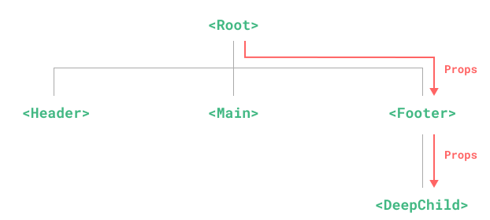
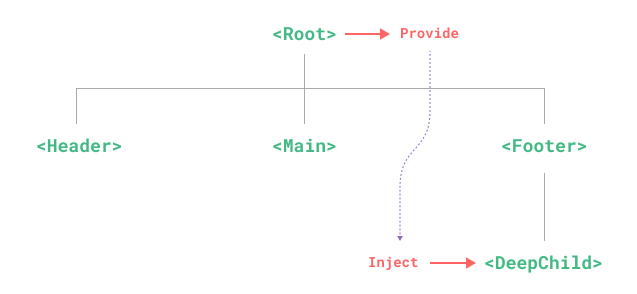

时长：40min

本节重点：
* vue3最佳实践
* ref
* reactive
* computed
* watch

# [API](https://cn.vuejs.org/api/)

# vue3最佳实践

* [单文件组件（即 *.vue 文件）](https://cn.vuejs.org/guide/scaling-up/sfc)
* 组合式API+TypeScript

注：组合式API一般都会配合`<script setup>`语法使用,`<script setup>`是在单文件组件中使用组合式API的编译时语法糖（[setup了解](https://cn.vuejs.org/api/sfc-script-setup)）。
  
**Vue3写法最佳实践：单文件组件+ 组合式API+`<script setup>`语法糖+TypeScript**

[演练场](https://play.vuejs.org/#eNp9kt9qE0EYxV9lXISmNNmIelU2QS0VFPyDzeVcdN2dpNNuZpad2RhZFlJQC1VpU9NeqBhEqlEorVQEq30and34Fn6zm6QtSC8C4TvnO/ObsxMZ133fbIXEmDUsSZq+Z0tSxQwh60KphNTmftob/Dl6ln79qd49Tz50kv6u2noxXPui1gfD97vq6QCVStlCFCGHh0yakt+kbeIWLk+jOAbFehhKyRm65njUWalgw3ZdbFTntBlRMTvZBLtVzs2QaJXP8MBAOAH1JRJEhj7ybNaALCkgqlw+Ic3U4f5ecridHu4Aa+2xTxayTR1Dmz4PJIpQQOpFxNkdfTBxUYzqAW+iKahiCjPMdOSrl+qop35tpOvfk84qZg5nQo5QKzqgcGl65E3efEt6P3Lj787q8NNHtdHVw52D9PUTtXacbB+MA+D6sF6YRpUqijRTXlvL9kIyM4MZdJZlpr2+6h6r7iB52/+79VntbWI2AS6c2WeCe8T0eKOwWFsiiDIqqe2NUKlAF6NTZ8TmImDH8LPKeaVQsFGEKiGoThvmsuAM3kOWjQ2HN33qkeCeLykchA34YFrRmu15/NHtbCaDkBTHc2eJOCv/mS+Ltp5h435ABAlaBBsTTdpBg8hcnl+4S9rwfyI2uRt64D5HfECghFAz5rYbIXMB+5Qvo72VPQDKGjUx35aEifGlNKh2xpkfG/AS5s65+gnuFfNqtgedGvE/zfVJWw==)

## 组合式API
Composition API是V3和V2.7的内置功能，具体是指一系列API的集合，可以使用函数的方式书写vue组件（vue2是声明选项式），它包括如下api：
* 响应式API（ref、reactive）
* 生命周期钩子（onMounted、onUnmounted）
* 依赖注入（provide、inject）

### 响应式基础
#### [ref](https://cn.vuejs.org/guide/essentials/reactivity-fundamentals.html#ref)
ref 函数用来创建响应式的数据。它接收一个参数，并返回一个包含该参数的响应式数据。
1. 可以使用ref()方法创建一个可以使用任何值类型的响应式。它将传入的参数包装成一个带.value属性的ref对象。声明Object类型时内部通过reactive来转为代理对象。
2. ref能创造一种对任意值的“引用”，并且不丢失响应性。

**注意：**
1. 可以响应式的替换整个对象（重写）。
2. 解构或者被传入函数时，不会丢失响应性。

#### [reactive](https://cn.vuejs.org/guide/essentials/reactivity-fundamentals.html#reactive)
reactive 函数用来创建响应式的数据。它接收一个参数，并返回一个包含该参数的响应式数据。
1. 可以使用reactive() 函数创建一个响应式对象或数组。
2. reactive仅对对象类型有效（对象、数组、Map、Set），原始类型（string、number、boolean）无效。

**注意：**
1. 不可用随意“替换”（复写）一个响应式对象，会导致对于初始应用的响应性连接丢失。
2. 响应式对象被赋值给另一个本地变量时，本地变量调整不会影响响应式变量。
3. 将响应式变量解构，之后修改值，不会影响原始响应式变量。
4. 将响应式变量传入一个函数时，之后的调整不影响响应式变量。

#### [computed](https://cn.vuejs.org/guide/essentials/computed.html)
computed 函数用来创建计算属性。它接收一个参数，并返回一个包含该参数的响应式数据。
使用场景：常用于计算衍生值。
默认是只读的。
return返回的是一个计算属性ref，其他方法中可通过.value取值。

**注意：**
1. 计算属性只做计算，不要在此处做异步请求或者更新DOM

```vue
<template>
  <p>{{bookObj.author}}:是否写过书？</p>
  <span>{{hasBook}}</span>
  <h1>{{authorInfo}}</h1>
</template>

<script setup lang="ts">
  import{  ref,reactive,computed}from 'vue'
  const bookObj = reactive({
    author:'张爱玲',
    age:'40',
    books:['book1','book2','book3']
  });

  // 定义一个计算属性
  const hasBook = computed(()=>{
    return bookObj.books.length > 0 ? 'Yes':'No'
  })
   
</script>
```

#### [watch 和 watchEffect](https://cn.vuejs.org/guide/essentials/watchers.html)
侦听器使用场景：计算属性不能做的事，可以通过侦听器进行，例如更改Dom，或者根据异步操作的结果修改另一个值。
watch 函数用来监听响应式数据的变化。它接收两个参数，并返回一个包含该参数的响应式数据。
* immediate ：是否在侦听器创建时立即执行回调函数
* deep ：是否深度监听

2者不同：
1. watch：</br>
   a. 懒执行，数据发生变化时才会触发</br>
   b. 既要指明监视的属性，也要指明监视的回调
2. watchEffect：</br>
   a. 在创建侦听器时，立即执行一遍回调</br>
   b. 不用指明监视哪个属性，监视的回调中用到哪个属性，那就监视哪个属性

```vue
<script setup>
import { ref, watch, watchEffect } from 'vue'
const todoId = ref(1)
const data = ref(null)

watch(
  todoId,
  async () => {
    const response = await fetch(`https://jsonplaceholder.typicode.com/todos/${todoId.value}`
    )
    data.value = await response.json()
  },
  { immediate: true }
)

watchEffect(async () => {
   const response = await fetch(`https://jsonplaceholder.typicode.com/todos/${todoId.value}`
   )
   data.value = await response.json()
})
</script>
```

### 依赖注入
+ provide()
+ inject()

provide() 提供一个值，可以被后代组件注入。
主要为解决props只能逐级透传的问题。父组件作为所有子组件的依赖提供者，后续所有的后代组件都可以使用

* 之前



* 现在



父组件
```vue
<script setup>
import { ref, provide } from 'vue'


// 提供响应式的值
const count = ref(0)
provide('count', count)


const location = ref('North Pole')
function updateLocation() {
  location.value = 'South Pole'
}
provide('location', {
  location,
  updateLocation
})

</script>
```
后代组件
```vue
<!-- 在注入方组件 -->
<script setup>
  import { inject } from 'vue'

  const { location, updateLocation } = inject('location');
  const count = inject('count');
</script>

<template>
  <button @click="updateLocation">{{ location }}</button>
  <div>{{count}}</div>
</template>
```

## 实战
打开本地项目，执行如下命令安装依赖
* [antdv安装](https://www.antdv.com/docs/vue/getting-started-cn)
```js
pnpm i --save ant-design-vue@4.x
```
* 删除App.vue中的无用代码
* 修改main.ts
```js
import { createApp } from 'vue'
import { createPinia } from 'pinia'
import Antd from 'ant-design-vue';
import 'ant-design-vue/dist/reset.css';

import App from './App.vue'
import router from './router'

const app = createApp(App)

app.use(createPinia())
app.use(router)
app.use(Antd)

app.mount('#app')
```
带大家写一个简单的页面结构：表单+表格，效果如下：


# 练习题
编写一个带有排序和过滤条件的表格 效果参考：


# 总结
* setup 语法糖帮助更简写代码，减少代码量。
* ref 和 reactive 声明响应式数据，ref 可以创建任意值类型的响应式数据，使用需要添加.value，reactive 只能创建对象类型和数组类型的响应式数据。
* computed、watch和watchEffect用于衍生数据的计算和数据侦听 。watchEffect 不需要指明监听的属性，它会在回调中用到哪个属性，就监听哪个属性。
* provide 和 inject 用于依赖注入，解决组件层级过深传递数据的问题。
