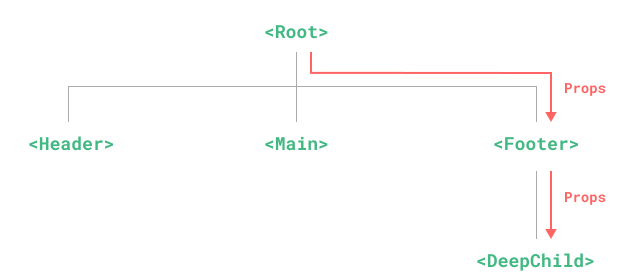
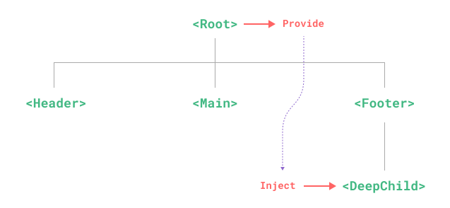
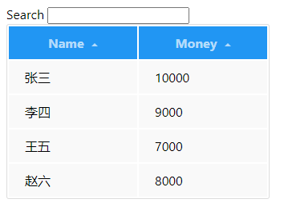

# API
官网：[Vue3 API盘点](https://cn.vuejs.org/api/)

## 组合式API
Composition API是V3和V2.7的内置功能，具体是指一系列API的集合，可以使用函数的方式书写vue组件（vue2是声明选项式），它包括如下api：
* 响应式API（ref、reactive）
* 生命周期钩子（onMounted、onUnmounted）
* 依赖注入（provide、inject）

**Vue3写法最佳实践：单文件组件+ 组合式API+`<script setup>`语法糖+TypeScript**

###  setup
相比于普通的` <script>` 语法，`<script setup>`具有更多优势：

+ 更少的样板内容，更简洁的代码。
+ 能够使用纯 TypeScript 声明 props 和自定义事件。
+ 更好的运行时性能 (其模板会被编译成同一作用域内的渲染函数，避免了渲染上下文代理对象)。
+ 更好的 IDE 类型推导性能 (减少了语言服务器从代码中抽取类型的工作)

#### `setup() vs <script setup>`
setup()钩子函数适用场景
1. 在非单文件组件中使用组合式api时
2. 需要在选项式api中集成组合式api时

除此之外，官方都推荐使用优先使用`<script setup>`。`<script setup>`是在单文件组件中使用组合式API的编译时语法糖。

#### `<script setup>` 
`<script setup>` 中的代码会在每次组件实例被创建的时候执行。
它会在解析属性的时候将顶层的变量声明提升到当前组件的 `<template>` 中。
任何在`<script setup>` 声明的顶层的绑定 (包括变量，函数声明，以及 import 导入的内容（组件）) 都能在模板中直接使用。
**不用使用this**。[详见](https://cn.vuejs.org/api/sfc-script-setup)


### 响应式基础
#### ref
ref 函数用来创建响应式的数据。它接收一个参数，并返回一个包含该参数的响应式数据。
1. 可以使用ref()方法创建一个可以使用任何值类型的响应式。它将传入的参数包装成一个带.value属性的ref对象。声明Object类型时内部通过reactive来转为代理对象。
2. ref能创造一种对任意值的“引用”，并且不丢失响应性，此功能常用于将逻辑提取到组合函数中。

**注意：**
1. 可以响应式的替换整个对象（重写）。
2. 解构或者被传入函数时，不会丢失响应性。

#### reactive
reactive 函数用来创建响应式的数据。它接收一个参数，并返回一个包含该参数的响应式数据。
1. 可以使用reactive() 函数创建一个响应式对象或数组。
2. reactive仅对对象类型有效（对象、数组、Map、Set），原始类型（string、number、boolean）无效。

**注意：**
1. 不可用随意“替换”（复写）一个响应式对象，会导致对于初始应用的响应性连接丢失。
2. 响应式对象被赋值给另一个本地变量时，本地变量调整不会影响响应式变量。
3. 将响应式变量解构，之后修改值，不会影响原始响应式变量。
4. 将响应式变量传入一个函数时，之后的调整不影响响应式变量。

#### computed
computed 函数用来创建计算属性。它接收一个参数，并返回一个包含该参数的响应式数据。
使用场景：常用于计算衍生值。
默认是只读的。
return返回的是一个计算属性ref，其他方法中可通过hasBook.value取值
计算属性值会被缓存。方法会被重复调用。

**注意：**
1. 计算属性只做计算，不要在此处做异步请求或者更新DOM

```vue
<template>
  <p>{{bookObj.author}}:是否写过书？</p>
  <span>{{hasBook}}</span>

  <h1>{{authorInfo}}</h1>
  <button @click="changeFullName">
    修改fullName
  </button>
</template>

<script setup lang="ts">
  import{ reactive,computed}from 'vue'
  const bookObj = reactive({
    author:'张爱玲',
    age:'40',
    books:['book1','book2','book3']
  });

  // 定义一个计算属性
  const hasBook = computed(()=>{
    return bookObj.books.length > 0 ? 'Yes':'No'
  })


  const authorInfo = computed({
  // getter
  get() {
    return bookObj.author + ' ' + bookObj.age 
  },
  // setter
  set(newValue) {
    [bookObj.author, bookObj.age ] = newValue.split(',,,')
  }
})

 const changeFullName=()=>{
  authorInfo.value = {
     author:'大明星',
    age:'100',
  }
}
</script>
```


#### watchEffect
watchEffect 函数用来监听响应式数据的变化。它接收一个参数，并返回一个包含该参数的响应式数据。

侦听器使用场景：计算属性不能做的事，可以通过侦听器进行，例如更改Dom，或者根据异步操作的结果修改另一个值。

2者不同：
1. watch：
   a. 懒执行
   b. 既要指明监视的属性，也要指明监视的回调
2. watchEffect：
   a. 在创建侦听器时，立即执行一遍回调
   b. 不用指明监视哪个属性，监视的回调中用到哪个属性，那就监视哪个属性

#### watch
watch 函数用来监听响应式数据的变化。它接收两个参数，并返回一个包含该参数的响应式数据。
#### toRefs
toRefs 函数用来将响应式数据转换为普通对象。它接收一个参数，并返回一个包含该参数的响应式数据。
#### toRef
toRef 函数用来将响应式数据转换为普通对象。它接收两个参数，并返回一个包含该参数的响应式数据。
#### isRef
isRef 函数用来判断一个值是否是一个响应式数据。它接收一个参数，并返回一个包含该参数的响应式数据。
#### isReactive
isReactive 函数用来判断一个值是否是一个响应式数据。它接收一个参数，并返回一个包含该参数的响应式数据。

### [生命周期](https://cn.vuejs.org/api/composition-api-lifecycle)
onMounted()
注册一个回调函数，在组件挂载完成后执行。通常用于执行需要访问组件所渲染的 DOM 树相关的副作用。

onUnmounted()
注册一个回调函数，在组件实例被卸载之后调用。

onBeforeMount()
注册一个钩子，在组件被挂载之前被调用。

onActivated()
注册一个回调函数，若组件实例是` <KeepAlive> `缓存树的一部分，当组件被插入到 DOM 中时调用。

onDeactivated()
注册一个回调函数，若组件实例是 `<KeepAlive>` 缓存树的一部分，当组件从 DOM 中被移除时调用。

### 依赖注入
+ provide()
+ inject()
+ hasInjectionContext()

provide() 提供一个值，可以被后代组件注入。
主要为解决props只能逐级透传的问题。父组件作为所有子组件的依赖提供者，后续所有的后代组件都可以使用

* 之前



* 现在



父组件
```vue
<script setup>
import { ref, provide } from 'vue'


// 提供响应式的值
const count = ref(0)
provide('count', count)


const location = ref('North Pole')
function updateLocation() {
  location.value = 'South Pole'
}
provide('location', {
  location,
  updateLocation
})

</script>
```
后代组件
```vue
<!-- 在注入方组件 -->
<script setup>
  import { inject } from 'vue'

  const { location, updateLocation } = inject('location');
  const count = inject('count');
</script>

<template>
  <button @click="updateLocation">{{ location }}</button>
  <div>{{count}}</div>
</template>
```


# 练习题
编写一个带有排序和过滤条件的表格 效果参考：



[练习题 参考解决方案](练习题参考答案.md)
